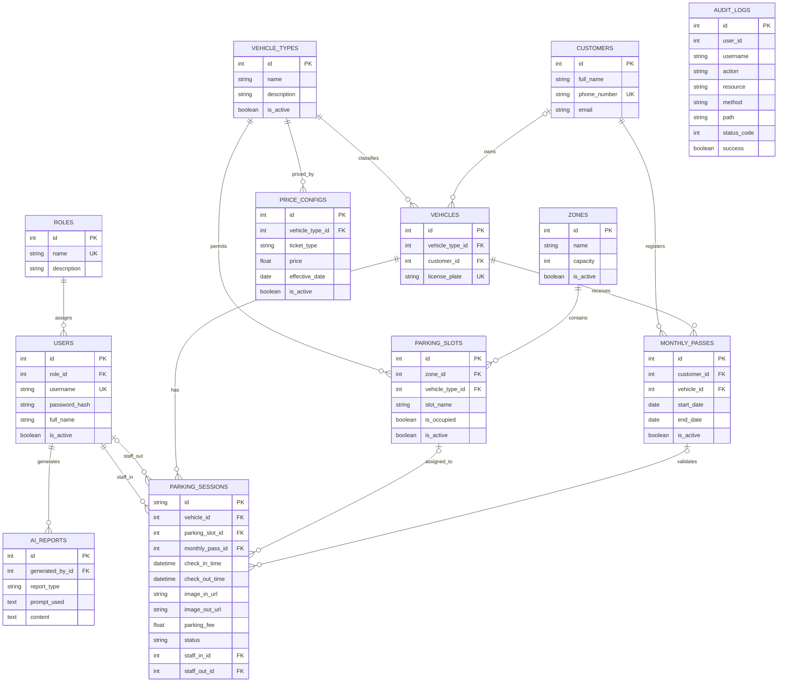

# KT2 - THIẾT KẾ CƠ SỞ DỮ LIỆU VÀ ERD

Thiết kế gồm 12 bảng nghiệp vụ, được tách theo thực thể để hạn chế lặp dữ liệu và hỗ trợ chuẩn hóa 3NF.

## Quan hệ chính

- Một vai trò có nhiều người dùng; mỗi người dùng thuộc một vai trò.
- Một khu vực chứa nhiều vị trí; mỗi vị trí dành cho một loại xe.
- Một khách hàng có thể sở hữu nhiều xe và đăng ký nhiều vé tháng.
- Một xe có nhiều phiên gửi theo thời gian, nhưng chỉ một phiên được phép `active` tại một thời điểm.
- Một phiên có thể gắn với vị trí và vé tháng; nhân viên vào là bắt buộc, nhân viên ra có thể rỗng trước check-out.
- `audit_logs.user_id` là ảnh chụp ID, không dùng khóa ngoại để lịch sử vẫn tồn tại nếu tài khoản bị xóa.
- Phiên gửi có vé tháng hợp lệ được gắn `monthly_pass_id` ngay khi check-in để truy vết lượt miễn phí.
- SQLite được bật `PRAGMA foreign_keys=ON` (backend/database.py) nên mọi khóa ngoại đều được thực thi;
  thao tác xóa dữ liệu đang được tham chiếu trả về mã 409.
- `image_in_url`/`image_out_url` là cột dự phòng cho hướng phát triển nhận dạng biển số bằng camera,
  hiện chưa có nghiệp vụ ghi giá trị.

## Lý do thiết kế

Các danh mục, giao dịch và lịch sử được tách riêng. Bảng giá lưu theo ngày hiệu lực để bảo toàn lịch sử. Phiên gửi xe tham chiếu các thực thể thay vì lặp tên/biển số/loại xe. Cấu trúc này giảm dư thừa, tránh phụ thuộc bắc cầu và phù hợp chuẩn hóa đến 3NF.
