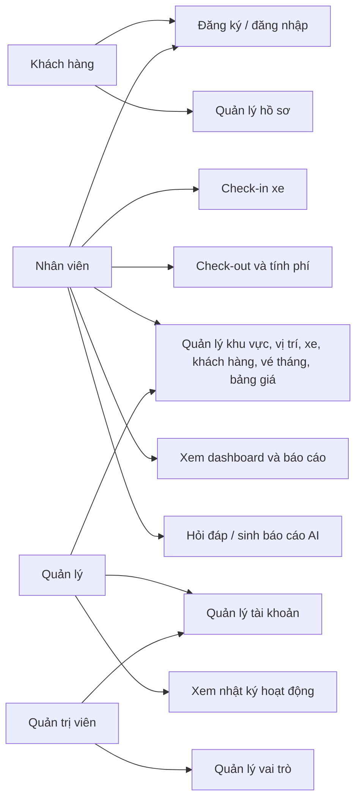
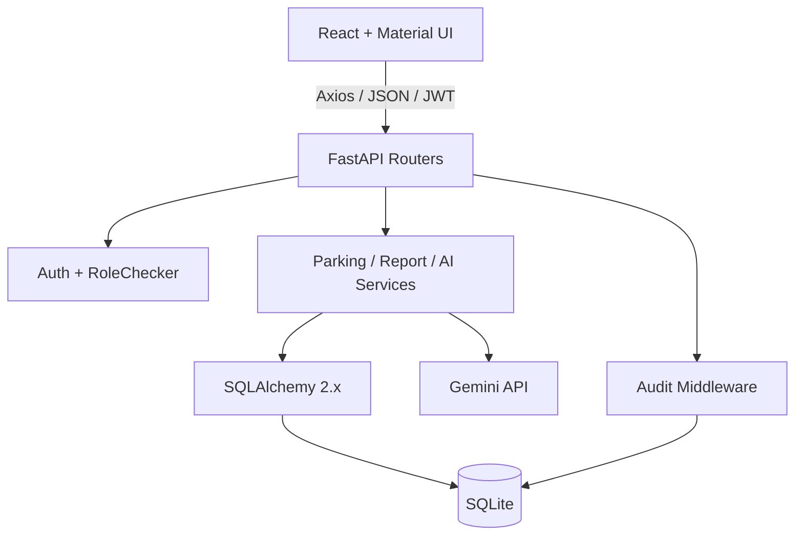
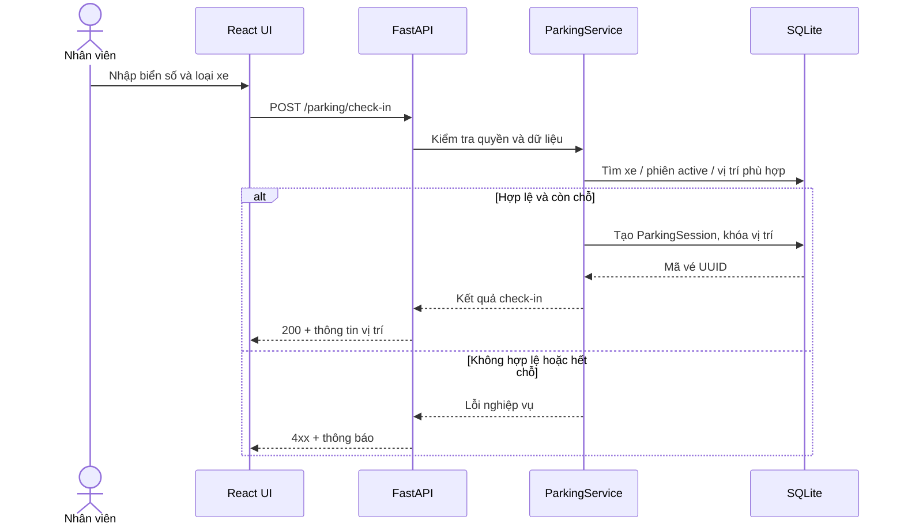
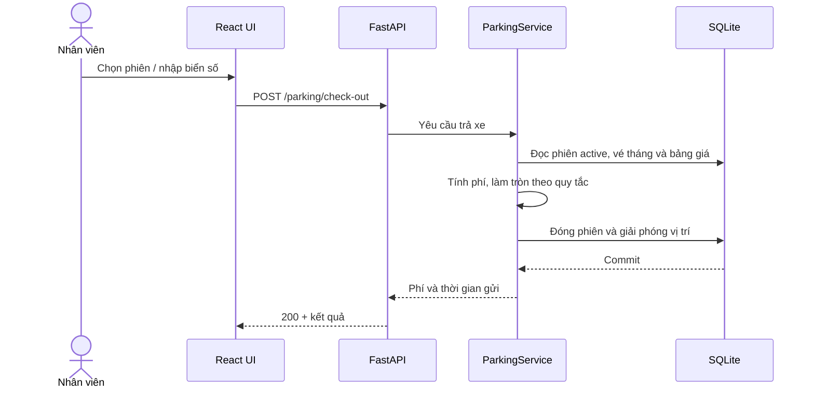
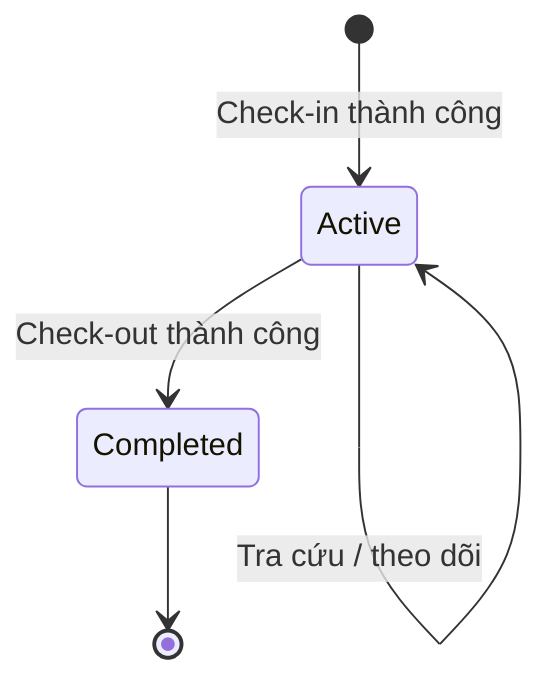

# KT2 - BIỂU ĐỒ UML

## 1. Use case tổng quát

```mermaid
flowchart LR
    C[Khách hàng] --> AUTH[Đăng ký / đăng nhập]
    C --> PROFILE[Quản lý hồ sơ]
    S[Nhân viên] --> AUTH
    S --> IN[Check-in xe]
    S --> OUT[Check-out và tính phí]
    S --> CRUD[Quản lý khu vực, vị trí, xe, khách hàng, vé tháng, bảng giá]
    S --> DASH[Xem dashboard và báo cáo]
    S --> AI[Hỏi đáp / sinh báo cáo AI]
    M[Quản lý] --> CRUD
    M --> USERS[Quản lý tài khoản]
    M --> AUDIT[Xem nhật ký hoạt động]
    A[Quản trị viên] --> USERS
    A --> ROLES[Quản lý vai trò]
```

## 2. Kiến trúc thành phần

```mermaid
flowchart TB
    UI[React + Material UI] -->|Axios / JSON / JWT| API[FastAPI Routers]
    API --> AUTH[Auth + RoleChecker]
    API --> SERVICE[Parking / Report / AI Services]
    SERVICE --> ORM[SQLAlchemy 2.x]
    ORM --> DB[(SQLite)]
    SERVICE --> GEMINI[Gemini API]
    API --> AUDIT[Audit Middleware]
    AUDIT --> DB
```

## 3. Trình tự check-in

```mermaid
sequenceDiagram
    actor Staff as Nhân viên
    participant UI as React UI
    participant API as FastAPI
    participant S as ParkingService
    participant DB as SQLite
    Staff->>UI: Nhập biển số và loại xe
    UI->>API: POST /parking/check-in
    API->>S: Kiểm tra quyền và dữ liệu
    S->>DB: Tìm xe / phiên active / vị trí phù hợp
    alt Hợp lệ và còn chỗ
        S->>DB: Tạo ParkingSession, khóa vị trí
        DB-->>S: Mã vé UUID
        S-->>API: Kết quả check-in
        API-->>UI: 200 + thông tin vị trí
    else Không hợp lệ hoặc hết chỗ
        S-->>API: Lỗi nghiệp vụ
        API-->>UI: 4xx + thông báo
    end
```

## 4. Trình tự check-out

```mermaid
sequenceDiagram
    actor Staff as Nhân viên
    participant UI as React UI
    participant API as FastAPI
    participant S as ParkingService
    participant DB as SQLite
    Staff->>UI: Chọn phiên / nhập biển số
    UI->>API: POST /parking/check-out
    API->>S: Yêu cầu trả xe
    S->>DB: Đọc phiên active, vé tháng và bảng giá
    S->>S: Tính phí, làm tròn theo quy tắc
    S->>DB: Đóng phiên và giải phóng vị trí
    DB-->>S: Commit
    S-->>API: Phí và thời gian gửi
    API-->>UI: 200 + kết quả
```

## 5. Biểu đồ trạng thái phiên gửi xe

```mermaid
stateDiagram-v2
    [*] --> Active: Check-in thành công
    Active --> Completed: Check-out thành công
    Active --> Active: Tra cứu / theo dõi
    Completed --> [*]
```
