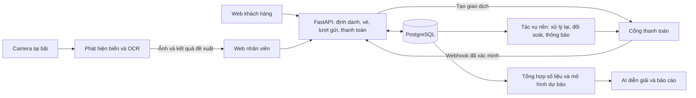

# Kế hoạch phát triển và mở rộng ParkingAI

Ngày lập: 07/09/2026.

Kế hoạch ban đầu được lập từ bản phát hành `f9e80a6`. Sau đó phạm vi được người dùng chốt là **đồ án**: QR thanh toán mô phỏng và điện thoại chụp biển số. Các module demo đã được bổ sung; xem [trạng thái triển khai và kiểm chứng hiện tại](EXPANSION_IMPLEMENTATION_STATUS.md) và [hướng dẫn demo](DEMO_GUIDE.md). Lộ trình dưới đây giữ lại các điều kiện cần có khi tiến tới vận hành thật; thời gian và ngưỡng nghiệm thu là ước lượng, không phải kết quả đã đo trên production.

## 1. Hướng sản phẩm đề xuất

Hành trình **tài khoản → đăng ký vé → thanh toán DEMO → sử dụng bãi → xem lịch sử và chứng từ → gia hạn**, camera chụp ảnh, đặt chỗ và nhiều bãi cùng đơn vị đã có trong bản đồ án. Các giai đoạn phía dưới mô tả kế hoạch ban đầu và điều kiện chuyển sang vận hành thật, không phải danh sách chức năng còn thiếu của demo.

| Phương án | Phạm vi | Khi phù hợp |
| --- | --- | --- |
| Mở rộng phục vụ đồ án | Cổng khách hàng, thanh toán thử nghiệm, nhận diện biển từ ảnh/video mẫu, minh chứng prompt/code/test | Cần minh họa đầy đủ nghiệp vụ và AI với phạm vi kiểm soát được; không gọi thanh toán thử nghiệm hoặc camera mẫu là vận hành thực tế |
| Sản phẩm cho một bãi — đề xuất ưu tiên | Cổng khách hàng, thanh toán thật sau nghiệm thu, camera thử một làn có nhân viên xác nhận, đối soát và phục hồi sự cố | Phù hợp nền tảng đã phát hành và giúp đo giá trị trước khi đầu tư thêm |
| Nền tảng cho nhiều bãi/doanh nghiệp | Phân quyền theo bãi/đơn vị, gói dịch vụ, báo cáo hợp nhất, quản lý thiết bị và cấu hình riêng | Chỉ mở sau khi có nhu cầu ở bãi thứ hai hoặc khách hàng doanh nghiệp; không đồng nhất nhiều khu vực trong một bãi với nhiều đơn vị kinh doanh |

## 2. Những gì đã có và có thể sử dụng tiếp

- FastAPI, React; production dùng PostgreSQL, Cloudflare Pages, Fly.io và GitHub Actions.
- Đăng nhập, phân quyền, dữ liệu khu vực/vị trí/xe/khách hàng, lượt vào/ra, tính phí, vé tháng và gia hạn.
- Xem phí trước checkout, xác nhận thu tiền, chống ghi thu lặp; sổ thu/hoàn và chốt ca.
- Sơ đồ chỗ đỗ, thống kê, xuất báo cáo, nhật ký hoạt động.
- AI báo cáo ngày/tuần, hỏi đáp số liệu, nhận xét cao điểm và gợi ý nhân sự.
- CI/CD, migration/readiness và monitor production định kỳ. Cần bổ sung quan sát nghiệp vụ và bằng chứng khôi phục thực tế, không xây lại các phần đã có.

Các khoảng trống ở mốc ban đầu (`User` chưa liên kết `Customer`, khách chưa có cổng riêng, thiếu đơn vé tháng) đã được xử lý trong phần mở rộng: hồ sơ/xe xác minh, quyền lịch sử, đơn và kết quả DEMO. Bốn nâng cấp A–D cũng đã có; xem [nghiệm thu độc lập](ACCEPTANCE_REVIEW_2026-09-07.md). Khoảng trống vận hành thật còn lại là xác nhận giao dịch nhà cung cấp, kiểm chứng hạ tầng mục tiêu và chất lượng nhận diện tại bãi.

Nguồn đối chiếu: [README](../README.md), [User](../backend/models/user.py), [Customer](../backend/models/customer.py), [Vehicle](../backend/models/vehicle.py), [Payment](../backend/models/payment.py), [dịch vụ vé tháng](../backend/services/monthly_subscription_service.py), [monitor hiện có](../.github/workflows/production-monitor.yml).

## 3. Lộ trình ưu tiên

Ước lượng dưới đây tính theo ngày làm việc của một lập trình viên đã quen dự án, có người hỗ trợ UAT. Chưa tính thời gian đăng ký dịch vụ thanh toán, mua/lắp camera, xin dữ liệu thử và thay đổi phạm vi. Giai đoạn 0–3 cùng nghiệm thu tổng thể dự kiến khoảng **8–12 tuần**; cần lập lại ước lượng sau khi chốt điều kiện thực tế.

| Giai đoạn | Kết quả cần có | Ước lượng | Điều kiện chuyển giai đoạn |
| --- | --- | --- | --- |
| 0. Chuẩn bị vận hành | Môi trường thử riêng, dữ liệu mẫu, chính sách gói vé, sở hữu xe, quan sát lỗi và diễn tập phục hồi | 3–5 ngày | Chốt quy tắc và chạy thử phục hồi; biết nơi nhận cảnh báo |
| 1. Cổng khách hàng | Khách xem xe, vé tháng, vị trí đang đỗ, lịch sử của mình; gửi yêu cầu đăng ký/gia hạn | 8–12 ngày | Kiểm thử phân quyền theo từng bản ghi đạt; không lộ dữ liệu khách khác |
| 2. Thanh toán online | Mua/gia hạn vé tháng, xác nhận giao dịch, kích hoạt vé, đối soát và xử lý ngoại lệ | 10–15 ngày | Test webhook, trả tiền muộn, giao dịch lặp và lỗi kích hoạt vé đạt; UAT dịch vụ thanh toán hoàn tất |
| 3. Camera một làn | Nhận diện biển, hiển thị ảnh và kết quả cho nhân viên kiểm tra trước khi vào/ra | 12–20 ngày | Có số đo tại chính làn thử, đủ tình huống ngày/đêm; lỗi camera không chặn đường xử lý thủ công |
| 4. Đặt trước và gói bảo đảm chỗ | Đặt theo khung giờ, hạn giữ, check-in, hủy/no-show, danh sách chờ | 10–15 ngày | Không bán vượt sức chứa khi thao tác đồng thời; chính sách rõ với xe vãng lai/vé tháng |
| 5. Phân tích dự báo | Dự báo 30–120 phút, cảnh báo bất thường, gợi ý ca dựa trên năng suất thực | 8–12 ngày cho bản đầu sau khi đủ dữ liệu | Backtest theo thời gian tốt hơn phương án đơn giản; công khai độ bất định |
| 6. Nhiều bãi và doanh nghiệp | Quản lý theo bãi, nhóm xe doanh nghiệp, báo cáo hợp nhất, tách dữ liệu đơn vị | Ước lượng riêng sau khảo sát | Có nhu cầu thật và kiểm thử cách ly dữ liệu; thiết kế chuyển đổi dữ liệu được duyệt |

Các giai đoạn 4–6 không thuộc cam kết 8–12 tuần. Thu thập dữ liệu và khảo sát vị trí camera có thể bắt đầu song song ngay từ giai đoạn 0.

## 4. Cổng khách hàng: bản đầu nên làm gì

### Chức năng

1. Liên kết tài khoản với hồ sơ khách đã có bằng quy trình xác minh hoặc lời mời được nhân viên duyệt; không nhận quyền sở hữu chỉ từ biển số hay số điện thoại được gõ vào.
2. Trang “Xe của tôi”: danh sách xe, tình trạng đang gửi, khu vực/vị trí và giờ vào. Thêm xe là yêu cầu cần kiểm tra khi trùng hồ sơ có sẵn.
3. Trang “Vé tháng”: xem quyền lợi, kỳ hiệu lực, giá gói và lịch sử gia hạn; đăng ký/gia hạn thông qua đơn yêu cầu.
4. Trang “Lịch sử & chứng từ”: chỉ dữ liệu được phép xem, có lọc theo xe/thời gian và tải chứng từ.
5. Thông báo trong ứng dụng khi đơn được xử lý hoặc vé sắp hết hạn. Email/Zalo/SMS triển khai sau khi chọn nhà cung cấp, ngân sách và người nhận.

### Thiết kế cần giữ

- Tạo nhóm chức năng `/me/...`; backend tự xác định khách từ tài khoản đang đăng nhập. Không mở nguyên quyền CRUD nhân viên cho customer.
- Chọn quan hệ tài khoản–khách 1:1 cho bản đầu, trừ khi đã có yêu cầu gia đình/doanh nghiệp dùng chung.
- Lưu căn cứ quyền truy cập lịch sử theo thời điểm; thay chủ xe không được chuyển toàn bộ lịch sử cá nhân của chủ trước sang chủ mới.
- Gói vé và giá do server xác định, có bản chụp điều khoản/giá trong đơn. Khách không tự gửi giá để được cấp vé.
- Giai đoạn đầu cho đăng ký/gia hạn bằng yêu cầu được nhân viên xử lý; chỉ bật tự kích hoạt sau khi phần thanh toán đạt nghiệm thu.

**Nghiệm thu:** tài khoản A không đọc/sửa được xe, vé, đơn hoặc lịch sử của B dù thay ID trong URL; việc nhận lại hồ sơ và đổi chủ được kiểm tra; gửi lặp yêu cầu không tạo hai kỳ vé.

## 5. Thanh toán online: bắt đầu với vé tháng

### Phương án

So sánh một phương án thu qua mã QR/chuyển khoản được xác nhận tự động với một cổng thanh toán theo nhu cầu khách. payOS và VNPAY là hai ứng viên để khảo sát; chọn **một** nhà cung cấp cho bản đầu sau khi xác minh khả năng mở tài khoản, môi trường thử, ngân hàng/phương thức hỗ trợ, đối soát, hoàn tiền và chi phí thực tế. Không chốt nhà cung cấp chỉ vì dễ tạo ảnh QR.

Tài liệu kỹ thuật và nguồn chính thức được tổng hợp trong [EXPANSION_TECH_RESEARCH.md](EXPANSION_TECH_RESEARCH.md).

### Luồng chính

`Chọn gói → server tạo đơn và giá → mở trang/mã thanh toán → nhận thông báo từ nhà cung cấp → xác minh → ghi thu và kích hoạt đúng một kỳ vé → gửi thông báo`.

- Tách đơn đăng ký, lần thử thanh toán và sổ thu đã xác nhận; trang khách quay về sau thanh toán chỉ hiển thị/tra cứu kết quả, không tự đánh dấu đã trả tiền.
- Kiểm chữ ký theo tài liệu nhà cung cấp, đối chiếu đơn, số tiền, loại tiền/tài khoản nhận trong phạm vi hợp đồng tích hợp và trạng thái giao dịch; chống xử lý trùng bằng mã giao dịch duy nhất.
- Ghi nhận sự kiện bền vững trước khi xác nhận đã tiếp nhận webhook. Tác vụ nền xử lý lại khi lỗi; công việc chờ phải tiếp tục được sau khi tiến trình khởi động lại.
- Kích hoạt vé và ghi chứng từ trong một giao dịch nội bộ; nếu lỗi thì vẫn giữ giao dịch nhà cung cấp để xử lý lại/đối soát, không yêu cầu khách trả thêm lần nữa.
- Tách khoản thu tự động với khoản nhân viên xác nhận, và với tiền mặt trong ca. Không giả mạo nhân viên thu tiền để dùng lại nguyên luồng hiện tại.
- Thanh toán đến sau hạn đơn, sai số tiền, thừa/thiếu tiền hoặc callback đến sai thứ tự đi vào danh sách cần đối soát theo quy tắc đã chốt. Không bỏ qua tiền thực nhận và không tự kích hoạt quyền lợi sai kỳ.
- Có màn hình tra cứu giao dịch/đối soát. Nghiệp vụ hoàn tiền cần trạng thái yêu cầu, kết quả thực nhận từ nhà cung cấp và chứng từ hoàn; không coi việc đổi trạng thái trong ứng dụng là đã chuyển tiền ra ngân hàng.

**Nghiệm thu:** một giao dịch gửi webhook nhiều lần vẫn chỉ ghi một khoản thu và cấp một kỳ vé; chữ ký sai hoặc số tiền sai không kích hoạt; mất callback có thể đối soát; lỗi sau khi nhận tiền không làm thất lạc quyền lợi khách.

Chưa làm thanh toán online cho phí xe ra trong bản đầu: cần thêm thời hạn báo phí, thời gian cho phép ra sau khi thanh toán, phí phát sinh nếu ra muộn và xử lý xe vẫn còn trong bãi.

## 6. Computer Vision: thử một làn, có người xác nhận

### Cách triển khai

1. Thử trên ảnh/video được phép sử dụng: phát hiện vùng biển số, cắt/căn chỉnh, nhận dạng ký tự và chuẩn hóa kết quả; giữ cả kết quả gốc để kiểm tra.
2. Đánh giá trên bộ dữ liệu tách riêng, gồm ô tô/xe máy, biển một/hai dòng, ngày/đêm, chói sáng, góc nghiêng và ảnh mờ. Không lấy điểm của thư viện OCR làm độ chính xác thực tế của toàn hệ thống.
3. Tích hợp một camera/làn. Xử lý ảnh gần camera khi phù hợp thiết bị; gửi sự kiện và ảnh cần thiết lên hệ thống thay vì truyền toàn bộ video qua FastAPI.
4. Nhân viên xem ảnh và biển dự đoán, sửa nếu cần, rồi xác nhận qua nghiệp vụ check-in/checkout hiện có. Xe ra vẫn phải qua bước kiểm tra phí và thu tiền.
5. Gộp các khung hình cùng một xe thành sự kiện, chống ghi nhiều lượt; quy định khi nào một lần xe quay lại là sự kiện mới.

### Đo gì để quyết định mở rộng

- Tỷ lệ đọc đúng toàn bộ biển trên tập kiểm tra độc lập; tách rõ ngày/đêm, ô tô/xe máy. Có thể đặt mục tiêu ban đầu 95% ban ngày và 90% ban đêm, nhưng phải điều chỉnh sau khảo sát và không coi đó là cam kết sẵn có.
- Tỷ lệ nhân viên phải sửa, tỷ lệ bỏ sót/đọc nhầm, thời gian xử lý mỗi xe, sự kiện trùng và thời gian tiết kiệm so với nhập tay.
- Chạy thử khoảng hai tuần sau khi lắp để có tình huống thực tế. Chỉ mở thêm làn sau khi có kết quả đủ đại diện.
- Quy định ai được xem ảnh, thời gian lưu, xóa theo hạn và dung lượng. Không đưa ảnh biển số lên nơi công khai để thuận tiện debug.

Các lựa chọn OCR/detector và giấy phép cần đối chiếu nằm trong [nghiên cứu kỹ thuật](EXPANSION_TECH_RESEARCH.md). Chưa chọn mua camera/GPU trước khi thử điều kiện ánh sáng, khoảng cách và tốc độ xe tại làn.

Tự mở barrier là giai đoạn riêng sau pilot, cần kiểm tra sai nhận diện, xe bám đuôi, cảm biến an toàn, vé/quyền vào, thanh toán và nút điều khiển thủ công. Kết quả OCR đơn lẻ không đủ để cho xe ra.

## 7. Quản lý chỗ đỗ và đặt trước

Phải tách ba sản phẩm:

| Sản phẩm | Quyền của khách |
| --- | --- |
| Vé tháng thông thường | Hưởng chính sách phí trong thời hạn; không mặc nhiên bảo đảm một chỗ trống |
| Gói bảo đảm chỗ/chỗ cố định | Có phần sức chứa hoặc vị trí được phân bổ theo hợp đồng và thời hạn |
| Đặt trước | Có quyền đến trong khung giờ, hạn giữ và điều kiện hủy/no-show cụ thể |

“Quản lý chỗ của tôi” trong cổng khách hàng ban đầu là xem nơi xe đang đỗ và quyền được phân bổ. Khách không được tự đổi cờ trống/đang có xe hoặc tự giải phóng vị trí trong hệ thống.

Khi triển khai đặt trước, bổ sung trạng thái giữ tạm, xác nhận, đã đến, hủy, hết hạn/no-show; kiểm tra khoảng thời gian giao nhau và khóa sức chứa khi thao tác đồng thời. Chỗ đang có xe, chỗ bảo trì, gói bảo đảm chỗ và chỗ đang giữ phải cùng tham gia tính số có thể bán. Xe ở quá giờ cần quy tắc vận hành để xử lý ảnh hưởng đến lượt đặt tiếp theo.

Có thể làm danh sách chờ và thông báo có chỗ trước khi đầu tư chọn chính xác từng ô đỗ; lựa chọn này thường giảm ràng buộc vận hành của bản đầu.

## 8. AI và vận hành: nâng chất lượng quyết định

- **Cảnh báo bất thường:** phiên tồn tại quá lâu, chênh lệch ca, giao dịch cần đối soát, tỷ lệ hoàn tiền thay đổi. Quy tắc/số liệu phát hiện trước, AI giải thích bằng bằng chứng; quản lý quyết định xử lý.
- **Dự báo lưu lượng/chỗ trống:** bắt đầu thu dữ liệu theo khu vực và cửa sổ 15 phút, kèm thay đổi sức chứa và thời gian thiếu dữ liệu. Khoảng 8–12 tuần là mốc khởi đầu để thử mô hình, không bảo đảm đủ cho mùa vụ dài hạn.
- So sánh dự báo với cách lấy cùng giờ/cùng thứ tuần trước; chia tập theo thời gian. Chỉ phát hành khi sai số trên tập kiểm tra cải thiện rõ, thí dụ mục tiêu MAE giảm ít nhất 15%, và có hiển thị khoảng bất định. Đây là tiêu chí đề xuất, chưa phải số đo.
- **Nhân sự:** nâng cấp gợi ý hiện có bằng thời gian phục vụ/thời gian chờ/số nhân viên đo được, lịch nghỉ và ngân sách ca. Không biến giả định năng suất của LLM thành lịch bắt buộc.
- **Độ tin cậy:** bổ sung request ID, chỉ số thời gian check-in/checkout, lỗi xác nhận, chậm webhook, backlog tác vụ và tỷ lệ đọc sai biển; cảnh báo đến người phụ trách và kiểm tra cả thông báo phục hồi.
- Diễn tập phục hồi backup trên môi trường riêng, đo RPO/RTO; không xem việc có hướng dẫn hoặc có backup trên dashboard là đã khôi phục thành công.
- Mở rộng retry hiện có bằng danh sách thao tác chưa biết kết quả sau khi trình duyệt khởi động lại, tách dữ liệu theo tài khoản và hạn chế lưu thông tin nhạy cảm. Khi mất mạng, hiển thị rõ dữ liệu chỗ trống đã cũ.

Vận hành hoàn toàn offline là một hạng mục riêng: phải quyết định nơi có quyền xác nhận vào/ra, giới hạn sức chứa khi nhiều cổng mất kết nối và cách đối soát. Lưu web để xem offline hoặc xếp hàng request không tự giải quyết được tranh chấp chỗ và tiền.

Nguồn kỹ thuật cho đánh giá theo thời gian: [TimeSeriesSplit](https://scikit-learn.org/stable/modules/generated/sklearn.model_selection.TimeSeriesSplit.html). Hàng đợi telemetry và giới hạn phục hồi được mô tả tại [OpenTelemetry resiliency](https://opentelemetry.io/docs/collector/resiliency/); không đồng nhất nó với hàng đợi giao dịch thanh toán.

## 9. Kiến trúc mở rộng

Giữ một ứng dụng FastAPI với các module nghiệp vụ rõ ràng và một PostgreSQL. Bổ sung tiến trình nền khi có webhook/thông báo cần thử lại; chỉ thêm hạ tầng hàng đợi riêng sau khi có nhu cầu đo được. Camera chạy thành tiến trình xử lý ảnh riêng tại bãi hoặc nơi phù hợp tải thực.

Mô hình dữ liệu bổ sung theo từng giai đoạn: liên kết tài khoản–khách và quyền xe theo thời điểm; gói vé/đơn đăng ký; lần thử thanh toán/sự kiện nhà cung cấp; camera/làn/sự kiện nhận diện; sau đó mới đến đặt chỗ/phân bổ và dữ liệu nhiều bãi. Không tạo trước toàn bộ mô hình SaaS khi chỉ phục vụ một bãi.

Frontend và backend hiện có đường phát hành riêng. Với các tính năng mới, dùng cơ chế bật/tắt và hợp đồng tương thích trong giai đoạn chuyển phiên bản; tránh để màn hình mới gọi chức năng backend chưa sẵn sàng hoặc khách cũ gửi hợp đồng đã bị loại bỏ.

## 10. Bản mở rộng đầu tiên và backlog tiếp theo

Đề xuất phạm vi bản mở rộng đầu tiên: **cổng khách hàng + mua/gia hạn vé tháng online + camera một làn có nhân viên xác nhận**. Mỗi phần có thể phát hành riêng sau nghiệm thu, không chờ tất cả xong mới đưa giá trị đến người dùng.

Backlog bắt đầu cho cổng khách hàng:

1. Chốt liên kết User–Customer, xác minh hồ sơ và chính sách chuyển chủ xe.
2. Thiết kế nhóm chức năng xem hồ sơ, xe, vé, lịch sử và vị trí của chính khách.
3. Thiết kế gói vé/giá/đơn đăng ký với điều khoản có phiên bản; giữ nguyên quyền lợi đã chốt cho lượt gửi đang diễn ra.
4. Xây màn hình khách và luồng nhân viên xử lý yêu cầu; kiểm thử truy cập chéo, dữ liệu rỗng và gửi lặp.
5. UAT khách mới/khách cũ, bổ sung hướng dẫn, rồi mở cho nhóm người dùng thử.

Sau bản đầu, chọn chức năng theo phản hồi: thông báo hết hạn, danh sách chờ, hỗ trợ/yêu cầu hoàn tiền; tiếp đến nhóm xe gia đình/doanh nghiệp, khách vãng lai được mời bằng QR và báo cáo hợp nhất nhiều bãi. Tích hợp sạc xe điện chỉ nên khảo sát khi bãi có thiết bị và chính sách tính phí điện riêng.

Chưa ưu tiên: native app nếu web trên điện thoại đã đáp ứng, Kubernetes/microservices khi chưa có nhu cầu tải/tổ chức, nhiều cổng thanh toán đồng thời, tự huấn luyện OCR từ đầu, để AI tự tính phí hoặc tự chỉnh chứng từ.

## 11. Điều kiện để chốt lịch và ngân sách

Trước khi bắt đầu triển khai giai đoạn tương ứng, cần chốt: mục tiêu đồ án hay vận hành thật; số bãi/làn/xe cao điểm; số người phát triển/UAT; loại vé có bảo đảm chỗ hay không; đơn vị đứng tên thu tiền và nhà cung cấp được chấp nhận; camera/đường mạng sẵn có; yêu cầu lưu ảnh, backup, thời gian gián đoạn chấp nhận được và ngân sách.

Chưa có đủ thông tin để báo tổng chi phí đáng tin cậy. Khi chốt, tách chi phí một lần (triển khai, thiết bị/lắp đặt) khỏi chi phí định kỳ (máy chủ, lưu ảnh, suy luận AI, giao dịch thanh toán, thông báo và bảo trì); xác minh biểu phí trực tiếp với nhà cung cấp ở thời điểm mua.
