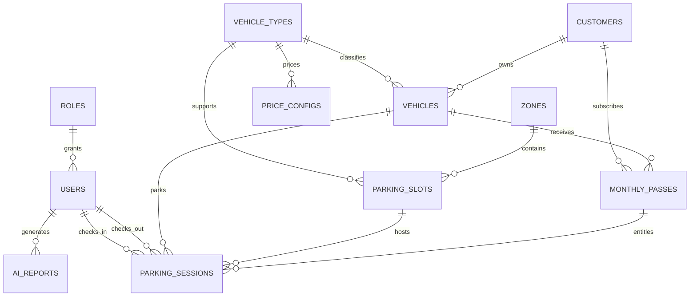

# KT1 — Phân tích nghiệp vụ và thiết kế cơ sở dữ liệu

Tài liệu này là kết quả tự chứa của giai đoạn KT1 cho đề tài **Hệ thống quản lý bãi đỗ xe tích hợp AI**. Nội dung được đối chiếu với model SQLAlchemy và migration hiện hành; người chấm không cần mở liên kết bên ngoài để hiểu thiết kế.

## 1. Bất biến nghiệp vụ chính

- Một phương tiện chỉ có tối đa một phiên gửi xe `active`; một vị trí chỉ phục vụ tối đa một phiên `active`.
- Vị trí được cấp phải đang hoạt động, còn trống và đúng loại xe; sức chứa khu vực không được nhỏ hơn số vị trí đã tạo.
- Biển số, tên khu vực, tên loại xe và tên vị trí là duy nhất sau khi chuẩn hóa Unicode/hoa-thường theo contract tương ứng.
- Check-in và check-out là giao dịch nguyên tử. Check-out tính phí rồi giải phóng vị trí; lỗi giữa chừng phải rollback toàn bộ.
- Phiên được lưu chỉ có `active`, `completed` hoặc `cancelled`; trạng thái chuyển tiếp `checking_out` không được tồn tại sau khi giao dịch kết thúc.
- Một loại xe chỉ có tối đa một bảng giá đang hoạt động. Giá VND là số nguyên không âm và phiên lưu lại nguồn giá để kết quả thanh toán không đổi theo cấu hình tương lai.
- Vé tháng chỉ miễn phí khi đã gắn vào phiên và còn bao phủ ngày xe ra; thời gian nghiệp vụ dùng múi giờ `Asia/Ho_Chi_Minh`.
- AI chỉ nhận dữ liệu tổng hợp do backend cung cấp, không được tự tạo số liệu và không được coi câu hỏi người dùng là chỉ thị hệ thống.

## 2. Danh mục bảng và khóa

Ký hiệu: **PK** — khóa chính, **FK** — khóa ngoại, `?` — cho phép `NULL`.

| Bảng | Trường chính (kiểu dữ liệu) | Khóa và mục đích |
| --- | --- | --- |
| `roles` | `id INTEGER`, `name VARCHAR(50)`, `description VARCHAR(255)?`, `created_at DATETIME`, `updated_at DATETIME` | **PK** `id`; tên vai trò canonical: `customer`, `staff`, `manager`, `admin` |
| `users` | `id INTEGER`, `role_id INTEGER`, `username VARCHAR(50)`, `password_hash VARCHAR(255)`, `full_name VARCHAR(100)`, `is_active BOOLEAN`, timestamps | **PK** `id`; **FK** `role_id → roles.id`; `username` unique |
| `vehicle_types` | `id INTEGER`, `name VARCHAR(50)`, `description VARCHAR(255)?`, `is_active BOOLEAN`, timestamps | **PK** `id`; unique `unicode_casefold(name)` |
| `zones` | `id INTEGER`, `name VARCHAR(50)`, `capacity INTEGER`, `is_active BOOLEAN`, timestamps | **PK** `id`; unique tên đã chuẩn hóa; `capacity >= 0` |
| `parking_slots` | `id INTEGER`, `zone_id INTEGER`, `vehicle_type_id INTEGER`, `slot_name VARCHAR(50)`, `is_occupied BOOLEAN`, `is_active BOOLEAN`, timestamps | **PK** `id`; **FK** tới `zones`, `vehicle_types`; tên vị trí chuẩn hóa unique toàn bãi |
| `customers` | `id INTEGER`, `full_name VARCHAR(100)`, `phone_number VARCHAR(20)`, `email VARCHAR(100)?`, timestamps | **PK** `id`; số điện thoại chuẩn hóa unique |
| `vehicles` | `id INTEGER`, `license_plate VARCHAR(20)`, `vehicle_type_id INTEGER`, `customer_id INTEGER?`, timestamps | **PK** `id`; **FK** tới `vehicle_types`, `customers`; biển số chuẩn hóa unique |
| `monthly_passes` | `id INTEGER`, `customer_id INTEGER`, `vehicle_id INTEGER`, `pass_code VARCHAR(50)?`, `price INTEGER`, `start_date DATE`, `end_date DATE`, `is_active BOOLEAN`, timestamps | **PK** `id`; **FK** tới `customers`, `vehicles`; `price >= 0`, `end_date >= start_date`, mã thẻ chuẩn hóa unique khi có giá trị |
| `price_configs` | `id INTEGER`, `vehicle_type_id INTEGER`, `ticket_type VARCHAR(20)`, `price INTEGER`, `effective_date DATE`, `is_active BOOLEAN`, timestamps | **PK** `id`; **FK** `vehicle_type_id → vehicle_types.id`; `ticket_type ∈ {HOURLY, DAILY}`; unique partial bảo đảm một giá active/loại xe |
| `parking_sessions` | `id VARCHAR(36)`, `vehicle_id INTEGER`, `parking_slot_id INTEGER?`, `monthly_pass_id INTEGER?`, `check_in_time DATETIME`, `check_out_time DATETIME?`, `image_in_url VARCHAR(255)?`, `image_out_url VARCHAR(255)?`, `parking_fee INTEGER?`, `status VARCHAR(20)`, `staff_in_id INTEGER`, `staff_out_id INTEGER?`, timestamps | **PK** `id`; **FK** tới xe, vị trí, vé tháng và nhân viên; unique partial bảo vệ xe/vị trí đang active; phí và thời gian do server kiểm soát |
| `ai_reports` | `id INTEGER`, `report_type VARCHAR(50)`, `prompt_used TEXT`, `content TEXT`, `generated_by_id INTEGER`, `created_at DATETIME` | **PK** `id`; **FK** `generated_by_id → users.id`; lưu vết nội dung báo cáo AI |
| `audit_logs` | `id INTEGER`, `user_id INTEGER?`, `username VARCHAR(50)`, `action VARCHAR(30)`, `resource VARCHAR(80)`, `resource_id VARCHAR(80)?`, `method VARCHAR(10)`, `path VARCHAR(255)`, `status_code INTEGER`, `success BOOLEAN`, `ip_address VARCHAR(64)?`, `created_at DATETIME` | **PK** `id`; snapshot định danh và kết quả thao tác; không FK để log vẫn tồn tại khi tài khoản thay đổi |

## 3. Quan hệ giữa các thực thể

- Một `role` có nhiều `users`.
- Một `vehicle_type` có nhiều `vehicles`, `parking_slots` và `price_configs`.
- Một `zone` có nhiều `parking_slots`.
- Một `customer` có nhiều `vehicles` và `monthly_passes`; phương tiện vãng lai có thể không thuộc khách hàng.
- Một `vehicle` có nhiều `parking_sessions` và `monthly_passes` theo thời gian.
- Một `parking_slot` có nhiều phiên lịch sử nhưng chỉ tối đa một phiên đang hoạt động.
- Một `monthly_pass` có thể được tham chiếu bởi nhiều phiên trong thời hạn.
- Một `user` tạo nhiều phiên vào/ra và nhiều `ai_reports`.

## 4. ERD Mermaid

## 5. Lý do đạt chuẩn 3NF

- Mỗi bảng biểu diễn đúng một loại thực thể hoặc sự kiện; thuộc tính không lặp theo nhóm.
- Thuộc tính mô tả phụ thuộc vào toàn bộ khóa chính, không phụ thuộc một phần khóa.
- Tên loại xe, khu vực, khách hàng và nhân viên không sao chép vào phiên gửi xe; phiên tham chiếu bằng FK. Phí đã chốt được lưu ở phiên hoàn tất, còn bảng giá của loại xe bị chặn sửa/xóa khi đang có phiên active. Nhật ký chủ ý lưu `username` dạng snapshot để vẫn đọc được sau khi tài khoản thay đổi.
- Các quan hệ nhiều-nhiều theo thời gian được biểu diễn qua thực thể nghiệp vụ `parking_sessions` và `monthly_passes`, tránh cột danh sách hoặc dữ liệu đa trị.

## 6. Minh chứng sử dụng AI trong SDLC

Prompt KT1 đã dùng:

> Bạn là Software Architect. Hãy phân tích bất biến xe vào/ra, vị trí trống, vé tháng và bảng giá cho hệ thống FastAPI/React/SQLite; thiết kế CSDL đạt 3NF, liệt kê PK/FK, quan hệ và ERD Mermaid. Không tự tạo yêu cầu ngoài dữ liệu được cung cấp; chỉ rõ các ràng buộc cần backstop ở database.

Kết quả AI được review lại với model, migration, test concurrency và schema readiness trước khi đưa vào tài liệu này. Prompt/code/test của KT2–KT3 được tổng hợp tại [AI_SDLC.md](AI_SDLC.md); hướng dẫn triển khai và rollback nằm tại [DEPLOYMENT.md](DEPLOYMENT.md).
