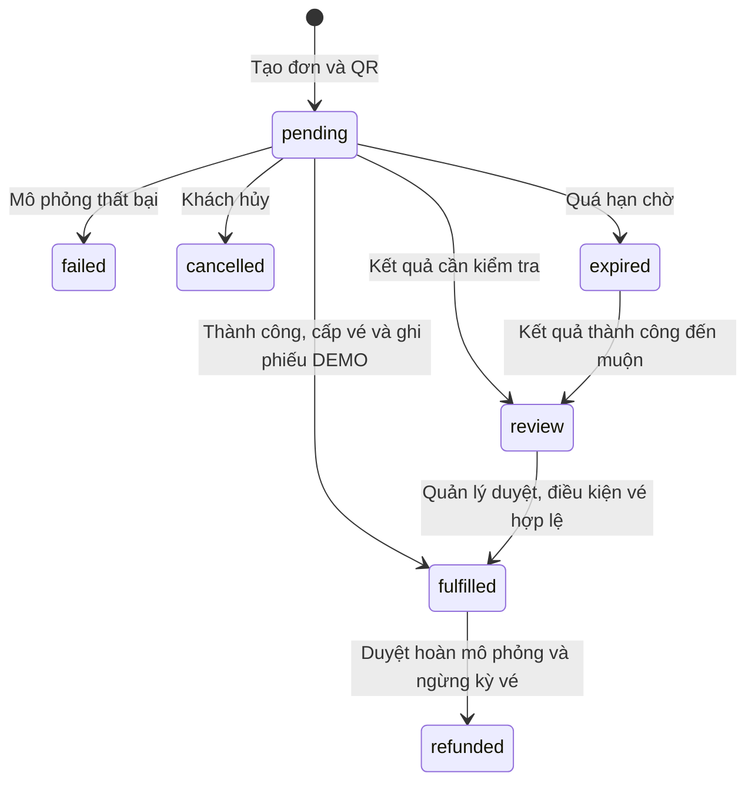

# Cổng khách hàng và thanh toán mô phỏng

## 1. Phạm vi đồ án

Khách tạo/liên kết hồ sơ, gửi yêu cầu thêm xe, xem xe/vé/lịch sử/chứng từ của mình, tạo đơn mua hoặc gia hạn vé tháng và thử QR ngẫu nhiên. Quản lý xác minh hồ sơ, công bố gói vé, xử lý yêu cầu hoàn và đơn cần đối soát. Không gọi cổng thanh toán hoặc ngân hàng.

`DEMO_PAYMENTS_ENABLED` mặc định tắt. Bộ chạy `scripts/start_demo.ps1` bật trên DB demo riêng. QR có dạng `PARKINGAI-DEMO:<order-id>:<random-token>`; không chứa tài khoản nhận tiền và không phải mã VietQR. Xem [hướng dẫn trình diễn](DEMO_GUIDE.md).

## 2. Quyền dữ liệu

- `PortalAccountLink` ánh xạ một tài khoản với một hồ sơ khách. Tạo hồ sơ mới chỉ khi số điện thoại chưa có; liên kết hồ sơ hiện hữu phải được quản lý duyệt.
- `PortalVehicleOwnership` là kết quả xác minh xe. Khi dùng xe, server kiểm tra cả quyền đã duyệt và chủ xe hiện tại.
- `PortalSessionGrant` ghi quyền xem lượt tại lúc xe vào. Đổi chủ/liên kết xe sau này không tự cấp quyền xem mọi lịch sử cũ. Migration không tự suy diễn quyền từ biển số hoặc số điện thoại.
- Các endpoint `/me/*` lấy khách từ tài khoản đăng nhập; không nhận ID khách từ trình duyệt để chọn dữ liệu.
- Gói và đơn thuộc bãi. Quản lý cần quyền phù hợp tại bãi để sửa gói, ghi thu hoặc duyệt hoàn. Xác minh danh tính là tác vụ chung của đơn vị vận hành; mô hình này chưa cách ly nhiều doanh nghiệp độc lập.
- PDF chỉ tải được bởi chủ chứng từ; trả `Cache-Control: private, no-store`. Giao diện giữ dữ liệu theo phiên đăng nhập và xóa dữ liệu của scope cũ khi đổi scope.

## 3. Vòng đời đơn



Sơ đồ mô tả các luồng trình diễn chính. Quyết định xử lý phải thỏa trạng thái và điều kiện trong dịch vụ; không được sửa trực tiếp trường trạng thái để bỏ qua quy trình.

Giá, bãi, loại xe và số ngày được lấy từ gói ở server. Đơn giữ lại giá/kỳ đã chốt; sửa gói sau đó không sửa đơn cũ. `idempotency_key` chống tạo đơn lặp; token QR được kiểm tra cùng quyền sở hữu đơn. Thành công lặp không tạo thêm kỳ vé/phiếu thu. Không được đổi kết quả của một sự kiện đã xử lý bằng cách gửi lại mã đó.

Kết quả mô phỏng được lưu vào inbox trước khi xử lý cấp vé. Worker thử lại khi xử lý bị gián đoạn, có thời điểm thử lại và số lần thử. Cấp vé, ghi thu và cập nhật đơn nằm trong giao dịch. Nếu giá trị, chủ xe, kỳ vé hoặc trạng thái bãi không còn hợp lệ, đơn được xử lý theo luồng ngoại lệ thay vì tự cấp quyền sai.

Đơn manual là lối mở cho thu tại quầy, có yêu cầu xác nhận đã thu đủ và phương thức cash/transfer. Giao diện khách trong đồ án mặc định tạo đơn DEMO.

Vé được cấp từ đơn portal phải gia hạn qua cổng khách hàng để kỳ mới giữ đúng bãi của đơn. API gia hạn vé tháng cũ trả HTTP 409 nếu được dùng để tạo kỳ mới cho vé này; không tạo kỳ vé hoặc phiếu thu trước khi từ chối. Trường hợp thử lại một khoản gia hạn đã ghi thu trước đó vẫn trả chứng từ cũ, không sửa lịch sử hoặc thu thêm. Vé legacy không bắt nguồn từ đơn portal giữ luồng gia hạn hiện có.

Quyền sử dụng vé portal được xác định theo bãi của vị trí xe vào. Khi dữ liệu đã có bãi, API v1 nhận xe bắt buộc chọn vị trí (thiếu trả HTTP 422); vé của bãi A không tự miễn phí tại bãi B. Nhân viên sử dụng màn hình **Vận hành bãi** cho quy trình này.

## 4. Tiền mô phỏng và hoàn

Phiếu DEMO dùng `Payment.method = demo`, không gắn ca thu ngân. Hệ thống chặn dùng DEMO cho phiếu thu lượt gửi thường và chặn hoàn thật từ phiếu DEMO hoặc ngược lại. Doanh thu thực loại bỏ DEMO; nhánh dữ liệu lịch sử cũng không cộng lại giá kỳ vé đã có phiếu DEMO. Kiểm tra có ở dịch vụ, ràng buộc DB và readiness.

Khách gửi yêu cầu hoàn từ đơn đã cấp vé. Quản lý xem lý do và duyệt/từ chối. Với DEMO, duyệt hoàn ghi phiếu hoàn cùng phương thức và ngừng kỳ vé; xe đang dùng kỳ vé trong bãi phải kết thúc lượt trước. Thao tác này không chuyển tiền. Màn hình thu ngân cũ không dùng nút hoàn cash/transfer cho chứng từ DEMO.

## 5. API và màn hình

Các đường dẫn dưới đây có tiền tố `/api/v2` và cần đăng nhập.

| Nhóm | Endpoint chính | Giao diện |
| --- | --- | --- |
| Hồ sơ | GET/POST `/me/profile`, GET/POST `/me/link-requests` | Bãi xe của tôi |
| Xe | GET `/me/vehicles`, GET/POST `/me/vehicle-requests` | Xe của tôi |
| Dữ liệu riêng | GET `/me/sessions`, `/me/passes`, `/me/receipts`, `/me/receipts/{id}/pdf` | Vé tháng, Lịch sử & chứng từ |
| Đơn | GET `/plans`, GET/POST `/me/orders`, GET `/me/orders/{id}` | Đăng ký & QR |
| Kết quả thử | POST `/me/orders/{id}/simulate`, `/me/orders/{id}/cancel` | Nút mô phỏng trên đơn |
| Hoàn | POST `/me/orders/{id}/refund-requests`, GET `/me/refund-requests` | Đơn của khách |
| Thông báo | GET `/me/notifications`, POST `/me/notifications/{id}/read` | Thông báo |
| Quản trị | `/portal/admin/link-requests`, `/vehicle-requests`, `/plans`, `/orders`, `/refund-requests` | Khách & đơn vé |

Các danh sách lượt, vé, đơn, chứng từ và thông báo hỗ trợ `limit`/`offset`; UI hiển thị từng trang 50 dòng. Danh sách yêu cầu xác minh/hoàn có giới hạn 100 dòng ở bản đồ án. Thông báo nằm trong ứng dụng, chưa gửi email/SMS.

## 6. Bảo trì và kiểm thử

Demo server chạy `run_portal_maintenance()` mỗi 30 giây: phục hồi sự kiện còn chờ xử lý, cho hết hạn đơn và nhắc kỳ vé còn 7/1 ngày. Truy vấn nhắc lọc thông báo đã có trước giới hạn batch để các vé sau batch đầu vẫn được xử lý. Có thể chạy một lượt khi đã đặt đúng `DATABASE_URL` của demo:

```powershell
Set-Location backend
../.venv/Scripts/python.exe -m expansion.portal_worker --once
```

Nhóm kiểm thử: `tests/test_portal_api.py`, `tests/test_portal_gateway.py`, `tests/test_portal_concurrency.py`, `tests/test_expansion_migration.py` và `tests/test_expansion_legacy_boundary.py`. Chúng kiểm tra quyền sở hữu, xử lý lặp/đồng thời, phục hồi inbox, phạm vi bãi, tách tiền DEMO, PDF và nâng cấp dữ liệu. Xem [trạng thái kiểm chứng](EXPANSION_IMPLEMENTATION_STATUS.md) cho kết quả cuối; không đồng nhất test mô phỏng với nghiệm thu thanh toán thật.

Kiểm thử bổ sung sau review nằm tại `tests/test_review_portal_legacy_regressions.py`: nhận xe có/không chọn vị trí, vé đúng/sai bãi, chặn gia hạn portal qua API cũ và trả lại khoản thu cũ khi retry. Lịch bảo trì 30 giây thuộc demo server; khi vận hành bằng cấu hình khác cần cấu hình worker/lịch chạy và giám sát riêng.
