# Phần mở rộng sau lõi — khách hàng, đặt chỗ, QR và computer vision

Cập nhật 15/09/2026 theo yêu cầu mới: không cần Claude; giữ đầy đủ lõi đồ án trước, sau đó triển khai các chức năng mở rộng dưới đây cho **một bãi duy nhất**. Tài liệu giữ phạm vi và tiêu chí đã duyệt; mã mở rộng đã được ghép và đang nghiệm thu P8. Kết quả thực tế xem [IMPLEMENTATION.md](IMPLEMENTATION.md); quy tắc phí online hiện hành xem [SESSION_FEE_PAYMENT_DESIGN.md](SESSION_FEE_PAYMENT_DESIGN.md). Không suy trạng thái triển khai hoặc nghiệm thu ngân hàng/camera thật từ các đề xuất lịch sử bên dưới.

Tài liệu lõi: [PROPOSAL.md](PROPOSAL.md). Nghiên cứu website thực tế: [REAL_WORLD_REFERENCES.md](REAL_WORLD_REFERENCES.md). Hai tài liệu này cùng xác định bản nâng cấp: phần mở rộng đã vào lộ trình chính thức, không còn chỉ là minh họa tùy chọn.

## 1. Những gì phải giữ nguyên trong mọi giai đoạn

F01–F13: đăng nhập/quyền manager–staff; khu/chỗ/loại xe; vào/ra/thời gian; tính phí; chỗ trống theo khu; tìm biển/ngày; vé tháng/khách quen; lưu lượng/doanh thu/cao điểm; AI báo cáo ngày/tuần; AI hỏi đáp; AI gợi ý nhân sự; test và minh chứng SDLC.

- Camera, thanh toán online hoặc AI lỗi vẫn có luồng nhận/trả xe thủ công đúng quyền. Không ghi nhận đã nhận tiền khi chưa có bằng chứng.
- Thêm khách hàng thành vai trò thứ ba; quyền manager/staff cốt lõi không bị bỏ hay gộp.
- Mọi nguồn vào/ra đều gọi cùng nghiệp vụ và giữ chống trùng xe/chỗ/giao dịch.
- Cùng một nguồn dữ liệu báo cáo; dữ liệu demo và giao dịch đã đối soát có nhãn rõ ràng.

## 2. Ba khu vực giao diện, một hệ thống

| Người dùng | Màn hình/chức năng |
|---|---|
| Khách hàng | Giới thiệu bãi, vị trí trên bản đồ, giờ mở cửa, bảng giá; đăng ký/đăng nhập; xe của tôi; mua vé giờ/ngày/tháng; đặt chỗ; thanh toán; vé/đặt chỗ/lượt gửi/hóa đơn của tôi; yêu cầu hỗ trợ/hoàn tiền |
| Nhân viên | Làn vào/ra, camera và biển đề xuất, quét mã vé, tìm xe, kiểm quyền vé/đặt chỗ, báo phí, thu tiền, chỗ trống, sự cố/mất vé, ca làm việc |
| Quản lý | Khu/chỗ/loại/giá, tài khoản nhân viên, gói vé, đơn/đặt chỗ, giao dịch/đối soát/hoàn tiền, ca, camera, báo cáo và ba nhóm AI, nhật ký |

Cập nhật 16/09/2026: hai mục còn thiếu của bảng trên — trang giới thiệu công khai (bản đồ, giờ mở cửa, bảng giá) và yêu cầu hỗ trợ/hoàn tiền cho khách với cả khoản ngoài DEMO — đã triển khai và nghiệm thu; xem [upgrade-2026-09-16/PUBLIC_SITE_AND_SUPPORT.md](../upgrade-2026-09-16/PUBLIC_SITE_AND_SUPPORT.md).

Tiếp tục dùng React responsive trong cùng ứng dụng. Khách trên điện thoại có luồng riêng; không cần ứng dụng mobile native để đạt đồ án. Trang giới thiệu chỉ có một bãi, không có tìm kiếm nhiều bãi hay marketplace.

## 3. Danh mục mở rộng và tiêu chí

| Mã | Chức năng mục tiêu | Điều kiện nghiệm thu |
|---|---|---|
| E01 | Portal tài khoản và xe | Khách chỉ xem/sửa tài nguyên của mình; nhận quyền xe/hồ sơ đã tồn tại phải qua kiểm chứng, không chiếm xe bằng cách nhập biển |
| E02 | Mua vé giờ, ngày, tháng | Hiển thị thời hạn, số lượt, giá, chính sách quá giờ; thanh toán/cấp quyền đúng một lần |
| E03 | Đặt chỗ theo thời gian | Chọn loại xe/khu và khoảng đến–đi; server giữ sức chứa, không bán trùng; tới bãi chuyển thành lượt thật |
| E04 | QR nhận tiền | QR gắn số tiền và mã đơn; backend xác minh giao dịch và cập nhật trạng thái; không tin nút “đã thanh toán” hay URL redirect |
| E05 | Hóa đơn/biên nhận và lịch sử | Xem số phải trả, đã trả, còn thiếu, thu/hoàn; tải PDF đúng quyền; retry không nhân bản chứng từ |
| E06 | Camera đọc biển số | Chụp/nhận ảnh → phát hiện biển → OCR → người xác nhận → vào/ra qua service lõi; đọc lỗi có nhập tay |
| E07 | Computer vision theo dõi ô | Camera cố định quan sát một khu, hiển thị ô có xe/trống/không xác định và thời điểm; lệch với hệ thống sinh cảnh báo |
| E08 | Thông báo và quản trị ngoại lệ | Sắp hết vé, đơn hết hạn, tiền đến muộn, đặt chỗ quá giờ, camera offline; xử lý có người chịu trách nhiệm và lưu vết |

## 4. Phân biệt các khái niệm để không thu sai hoặc bán trùng

| Khái niệm | Ý nghĩa |
|---|---|
| Gói vé | Sản phẩm với loại xe, thời lượng/quyền sử dụng, đơn giá và hiệu lực |
| Vé/quyền sử dụng | Quyền đã cấp cho xe sau khi điều kiện mua được đáp ứng |
| Đặt chỗ | Cam kết dành sức chứa trong một khoảng thời gian; không đồng nghĩa xe đã vào |
| Lượt gửi | Sự kiện vào/ra thực tế; quyết định chỗ đang bị chiếm và phần phí phát sinh |
| Đơn mua | Yêu cầu mua một sản phẩm/dịch vụ, có số phải trả |
| Yêu cầu thanh toán | Một lần thử thu tiền cho đơn/lượt; có hạn và mã provider |
| Chứng từ thu/hoàn | Sự kiện tiền đã xác nhận, bất biến, có liên kết nguồn |
| Hóa đơn trong portal | Bảng kê phải trả/đã trả và các biên nhận liên quan của khách; bản PDF của đồ án, không tự gọi là tích hợp hóa đơn điện tử thuế |

### Chính sách sản phẩm đề xuất

- Vé giờ: một lượt liên tục, số giờ hiển thị rõ; vé ngày: một lượt tối đa 24 giờ từ mốc đã công bố. Không ngầm hiểu vé ngày cho ra/vào nhiều lần.
- Vé tháng: nhiều lượt trong ngày bắt đầu–kết thúc đã công bố. Nếu bán gói 30 ngày thì ghi đúng “30 ngày”, không đánh đồng mọi tháng với 30 ngày.
- Mua vé tháng thông thường **không tự giữ một ô cố định**. Nếu bán quyền bảo đảm chỗ thì phải có gói riêng và trừ sức chứa theo lịch.
- Đặt chỗ giờ/ngày: một đơn gồm quyền gửi và quyền giữ chỗ trong cửa sổ đã chọn; mặc định không thêm “phí đặt chỗ” riêng để tránh thu hai lần. Giá/quyền được chốt trước thanh toán.
- Phần vượt thời gian gói được tính theo chính sách đã công bố; không tính lại phần đã được vé thanh toán bao phủ. Trả xe chỉ thu số còn thiếu; hoàn tiền tạo chứng từ riêng.
- Khách chọn khu/loại vị trí; server gán chỗ phù hợp, có thể hiển thị chỗ đã cấp. Cho chọn ô cụ thể chỉ khi dùng chung kiểm tra sức chứa và quy tắc chiếm chỗ.

## 5. Luồng khách hàng trọn vẹn

```mermaid
flowchart LR
  A[Đăng nhập và chọn xe] --> B[Chọn vé và khoảng thời gian]
  B --> C[Kiểm tra sức chứa và giữ chỗ có hạn]
  C --> D[Tạo đơn và QR thanh toán]
  D --> E[Server xác minh tiền]
  E --> F[Cấp vé và xác nhận đặt chỗ]
  F --> G[Nhân viên nhận xe bằng vé hoặc biển đã xác nhận]
  G --> H[Tính phần còn thiếu khi ra]
  H --> I[Thu đủ và xác nhận xe ra]
  I --> J[Biên nhận và lịch sử của khách]
```

Đối với vé tháng không bảo đảm chỗ: bỏ bước giữ chỗ; lúc vào vẫn kiểm sức chứa. Mua vé online không tự tạo xe đang ở trong bãi.

### Giữ chỗ và tình huống khó

- Giữ tạm sức chứa 10 phút là **mặc định thiết kế có thể cấu hình**, không phải quy tắc lấy từ website khác. Hạn link thanh toán không dài hơn hạn giữ tạm nếu đơn yêu cầu chỗ.
- Khoảng đặt dùng `[bắt đầu, kết thúc)`. Hai đặt chạm nhau tại mốc cuối không trùng lịch, nhưng khi tiếp nhận xe phải kiểm xe trước đã rời chỗ thật sự.
- Hết hạn giữ tạm thì trả sức chứa. Trả tiền đến muộn phải ghi nhận sự kiện tiền và chuyển đối soát; không mất giao dịch, không tự khôi phục chỗ đã cấp cho người khác.
- Giới hạn đến muộn được hiển thị, mặc định đề xuất 15 phút sau giờ hẹn và không quá cuối đặt chỗ. Không tới thì chuyển no-show, giải phóng cam kết theo chính sách; hoàn tiền là quyết định riêng.
- Hủy trước giờ hẹn: đề xuất cho gửi yêu cầu hoàn toàn bộ phần chưa dùng, quản lý duyệt. Không coi đơn đã hủy là tiền đã hoàn về ngân hàng.
- Xe ở quá giờ: vẫn chiếm chỗ cho đến khi nhân viên xác nhận ra; tính phụ trội/cảnh báo xung đột, không tự đánh dấu ô trống khi lịch đặt hết hạn.
- Chỗ có xe vãng lai chưa biết giờ ra không được hứa chắc cho đặt chỗ kế tiếp. Dùng một nhóm vị trí dành cho đặt trước hoặc chỉ mở bán chỗ không có ràng buộc hiện tại/tương lai đủ chắc chắn.

## 6. Thanh toán QR: tích hợp thật, mô phỏng có nhãn riêng

**Ứng viên tích hợp ưu tiên: payOS** vì có tài liệu Python/async tương thích hướng FastAPI, tạo link thanh toán và xác minh webhook. Đây là lựa chọn kỹ thuật đề xuất, chưa phải tài khoản/provider đã kết nối. [Python SDK chính thức](https://payos.vn/docs/sdks/back-end/python/).

Tạo QR và đối soát thanh toán là hai năng lực riêng: VietQR.IO mô tả công cụ tạo QR và hướng tới payOS cho giao diện kèm xác nhận. Vì vậy QR hiện có của ParkingAI không thể chỉ đổi hình/logo rồi coi là QR nhận tiền. [VietQR.IO](https://vietqr.io/intro/).

Backend tạo đơn với số tiền tính ở server, mã đơn duy nhất, hạn và mục đích (mua vé, đặt chỗ, trả phí lượt). Khách quét QR; website hiển thị “đang chờ xác nhận” cho tới khi server xử lý dữ liệu đã xác minh. Return URL phục vụ điều hướng giao diện; thiết kế ParkingAI không dùng query parameter đó làm bằng chứng đã nhận tiền. [Return URL](https://payos.vn/docs/du-lieu-tra-ve/return-url/).

Webhook phải được xác minh chữ ký theo SDK/tài liệu provider, rồi kiểm đúng đơn, mã giao dịch, tài khoản đích/cấu hình, số tiền, tiền tệ và trạng thái. Lưu event bền vững trước khi xử lý, chống trùng reference; retry/cập nhật đơn không tạo thêm biên nhận hoặc thêm vé. Chữ ký payOS dùng HMAC-SHA256 theo cách chuẩn hóa dữ liệu của họ. [Xác minh signature](https://payos.vn/docs/tich-hop-webhook/kiem-tra-du-lieu-voi-signature/), [API payment requests](https://payos.vn/docs/api/).

Đề xuất xử lý thiếu/thừa tiền, đơn không tồn tại, tiền đến sau hạn, sai trạng thái hoặc hai nguồn cùng báo trả: chuyển hàng đợi đối soát có lý do; không tự cấp quyền hai lần. Một lần thu đã xác nhận vẫn là sự kiện tiền ngay cả khi cấp vé/giữ chỗ gặp lỗi. Giao dịch và trạng thái cấp quyền cần theo dõi riêng để có thể retry hoặc hoàn đúng.

**payOS công bố hiện không có sandbox riêng.** Vì thế test tự động dùng adapter giả lập nội bộ; nghiệm thu kết nối thật là ca riêng trên tài khoản/ngân hàng người dùng cấu hình, với giao dịch và điều kiện thử được xác nhận trước. Không gọi simulator là sandbox payOS, không tạo giao dịch tiền thật trong task nghiên cứu này. [Môi trường test payOS](https://payos.vn/docs/moi-truong-test/).

### Trả tiền online không đồng nghĩa xe đã ra

Đơn thanh toán phí lượt tham chiếu session, phiên bản giá, số dư và quote. Quote hiện có 120 giây chỉ đủ cho xác nhận tại quầy; không mặc định khóa trong toàn bộ thời gian khách chuyển khoản.

Quy tắc đã triển khai thay thế ví dụ cộng thêm 10 phút trước đây: `paid_through` là cuối khối phí giờ/ngày đã được mua theo snapshot của lượt. Đề nghị online có TTL riêng mặc định 5 phút; TTL không phải thời gian miễn phí. Khi ra, tính tổng phí F theo snapshot, trừ ghi có online đã xác minh C và chỉ thu D=max(F−C,0); nếu đã trả đủ vẫn ghi biên nhận tất toán 0đ. Tiền đúng hạn có thể ghi có khi phí đã tăng sang khối tiếp theo, phần tăng thêm thu lúc ra. Tiền đến muộn hoặc sau khi quầy đã tất toán được giữ để đối soát; không giải phóng chỗ tự động. Chi tiết và ví dụ biên chính xác ở [SESSION_FEE_PAYMENT_DESIGN.md](SESSION_FEE_PAYMENT_DESIGN.md), cấu hình vận hành ở [P5_OPERATIONS.md](P5_OPERATIONS.md).

## 7. Camera và computer vision

### E06 — Biển số tại làn vào/ra

Tái sử dụng YOLO/RapidOCR và hàng đợi observation: ảnh → bounding box biển → OCR → chuẩn hóa → biển đề xuất → nhân viên đối chiếu và xác nhận → gọi service lõi. Hiện code đã hỗ trợ upload ảnh, camera điện thoại và điểm nhận sự kiện edge; chưa coi đó là đã chạy liên tục camera IP.

Màn hình cần có ảnh, biển đề xuất/chỉnh sửa, trạng thái OCR, chiều vào/ra, xe/vé tìm được, thao tác xác nhận. Chụp lặp cùng sự kiện không tạo nhiều lượt. Đọc sai, mờ, không có biển hoặc mất camera vẫn nhập tay được. Biển trùng/sai loại không được vượt guard vì OCR gợi ý.

Bản đồ án ưu tiên webcam/camera điện thoại hoặc một camera IP có sẵn ở một làn. Xử lý frame có giới hạn tại máy local/edge; không đẩy video liên tục qua API đang phục vụ thu tiền. Không bắt buộc barrier vật lý hoặc tự mở barrier.

### E07 — Theo dõi ô đỗ bằng hình ảnh

Đây là chức năng khác OCR: camera cố định nhìn các vùng ô đỗ đã khai báo. Detector/classifier suy ra `occupied`, `free` hoặc `unknown`, kèm thời điểm/độ tin cậy và nguồn camera.

Thử trước một vùng nhỏ 4–8 ô có góc nhìn phù hợp; đánh dấu polygon mỗi ô. Chỉ công bố thay đổi sau nhiều frame ổn định (mặc định đề xuất 3); quan sát quá hạn (đề xuất 30 giây), che khuất hoặc camera mất kết nối thì `unknown`.

Trên sơ đồ, tách trạng thái **nghiệp vụ** và **camera quan sát**. Nếu camera thấy xe ở chỗ hệ thống ghi trống, tạo cảnh báo kiểm tra. Không tự sửa trạng thái trả xe, phí hoặc chỗ của phiên active. Chỉ cán bộ có quyền thực hiện nghiệp vụ điều chỉnh với lý do. Dữ liệu AI phân tích chỉ sử dụng quan sát CV có nguồn/thời gian và ghi độ phủ, không biến dữ liệu camera thiếu thành số 0.

### Tiêu chí vision

- Bộ ảnh/frame có nhãn trước khi đo, tách khỏi phần tinh chỉnh; gồm biển/không biển, đúng/sai, tối/sáng/che một phần theo điều kiện demo thực sự có.
- OCR: số đọc đúng toàn biển, CER, số no-plate, số nhận nhầm, thời gian xử lý; tách ảnh crop và toàn xe.
- Ô đỗ: confusion matrix/precision/recall theo từng ô, trạng thái unknown và thời gian phát hiện thay đổi.
- Kiểm quyền truy cập camera thực tế trên thiết bị demo và thời gian đáp ứng của luồng quét. Không dùng confidence hoặc thông số quảng cáo của hãng làm accuracy của đồ án.
- Lưu ảnh theo hạn có sẵn, không công khai ảnh/biển; camera token được giới hạn quyền và có thể thu hồi.

## 8. Tái sử dụng mã hiện có và khoảng cần xây

Các đường dẫn dưới đây đã kiểm tra tồn tại tại HEAD `3ef172e`; không phải kết luận mọi chức năng đã nghiệm thu.

| Khối | Đang có | Khoảng cần nâng cấp |
|---|---|---|
| Portal | `CustomerPortal.jsx`, `PortalAdminPage.jsx`; account link, vehicle ownership, `/me/receipts` và PDF | Bố cục mua vé/đặt chỗ/thanh toán hoàn chỉnh một bãi; lịch sử và lỗi đúng quyền |
| Gói/đơn | `SubscriptionPlan.duration_days`, `PortalOrder` gắn monthly pass/receipt | Gói giờ và ngày có semantics riêng; entitlement theo thời gian; nguồn đơn theo loại; không nhét vé 2 giờ vào gói tháng |
| Thanh toán | `DemoGateway` không có network I/O; `PortalPaymentEvent` chống trùng provider/reference; `PaymentService` | Adapter provider thật, xác minh webhook, reconciliation, phân tách khoản nhận/cấp quyền, trả phí lượt online |
| Đặt chỗ | `ParkingReservation`, `GuaranteedAllocation`, `reservations.py`, `ReservationsPage.jsx` | Giữ tạm trước trả tiền và liên kết đơn–đặt chỗ–lượt; hiện reservation chỉ confirmed/arrived/cancelled/expired nên cần migration nếu thêm hold |
| Camera | `vision_models.py`, `vision_service.py`, `VisionPage.jsx`; YOLO/RapidOCR; `edge/evaluate_plates.py` | Kết nối thiết bị thực được chọn, chống sự kiện lặp, đo bộ biển Việt Nam và UX xác nhận |
| CV ô đỗ | Chưa thấy mô hình observation theo polygon/ô trong các file vision đã kiểm | Thêm slot observations/mapping camera–ô, stale/unknown và cảnh báo chênh lệch; tách khỏi giao dịch lõi |
| AI/báo cáo | `site_analytics.py`, `ai_service.py`, `CoreAnalyticsPage.jsx` | Giữ 3 chức năng; phân loại đơn/thu/hoàn/prepaid để không đếm đôi; quyền customer không được xem thống kê bãi |

Mô hình mở rộng cần tách các loại đơn và entitlement. `PortalOrder` hiện bắt buộc monthly_pass khi fulfilled; `payment_mode` chỉ demo/manual. Phải sửa schema, constraint, service và migration cùng nhau trước khi thêm cổng thật/gói giờ/ngày. Đây không chỉ là thêm vài nút giao diện.

## 9. Thứ tự triển khai và điểm nghiệm thu

| Bước | Phạm vi | Điểm qua bước |
|---|---|---|
| P0–P3 | Hoàn thiện lõi theo PROPOSAL.md | F01–F13 đầy đủ, có UAT manager/staff, giữ được đường demo cơ bản |
| P4 | Portal, gói giờ/ngày/tháng và đặt chỗ | E01–E03; dùng thanh toán tại quầy/adapter giả trong phát triển; chưa gọi là thanh toán online thật |
| P5 | QR provider, hóa đơn/biên nhận, đối soát | E04/E05 và thông báo đơn; test contract, webhook giả mạo/lặp/trễ; nghiệm thu thật riêng khi tài khoản được cấu hình |
| P6 | Camera LPR tại làn | E06; đủ quy trình ảnh/biển/người xác nhận/vào–ra; có số đo và xử lý lỗi |
| P7 | CV vùng ô đỗ | E07/E08; thiết bị/góc nhìn phù hợp, trạng thái unknown và đối soát chênh lệch hoạt động |
| P8 | Nghiệm thu tích hợp và hồ sơ cuối | Chạy lại F01–F13 cùng E01–E08; trình diễn khách–nhân viên–quản lý và cập nhật KT1–KT3/cuối kỳ |

Sau mỗi bước mở rộng chạy lại test bất biến vào/ra, phí, chỗ và AI; không chờ tới cuối mới phát hiện phần lõi hỏng. Chỉ gọi một tính năng hoàn tất khi có bằng chứng của tính năng đó, không lấy bộ test simulator để xác nhận bank/camera thực.

## 10. Ca kiểm thử tích hợp bắt buộc thêm

1. Hai khách mua chỗ cuối cùng cùng thời điểm; tối đa một đơn giữ được chỗ.
2. Đơn hết hạn, khách trả muộn, webhook đến lặp/đảo thứ tự; tiền không biến mất và không bán trùng.
3. Fake return URL hoặc webhook sai signature/amount/order; không đánh dấu paid.
4. Quầy thu tiền trong lúc khách đang trả online; ghi nhận/đối soát đúng, không thu double.
5. Vé giờ/ngày/tháng miễn phần được bao phủ; ra sớm/quá giờ không thu lại toàn bộ giá gói.
6. Đã trả online nhưng chưa ra: vẫn chiếm chỗ; hết hạn ra phải xem số dư phụ trội.
7. Vé tháng không bảo đảm ô gặp bãi đầy: xử lý đúng thông tin đã bán; gói giữ chỗ có sức chứa riêng.
8. Đổi chủ xe không lộ lịch sử cũ; khách sửa ID trên URL không xem được đơn/ảnh/PDF người khác.
9. OCR nhận sai/no-plate/sự kiện lặp; không tự tạo xe sai và không cản nhập tay.
10. CV mất camera/che khuất: unknown, không giải phóng chỗ hoặc phát sinh thu/hoàn.
11. Số liệu báo cáo sau thu vé, trả phí phụ trội, hủy/hoàn và khoản cần đối soát không đếm đôi; AI nói đúng nguồn và kỳ.
12. Backup/restore schema mở rộng và rollback code tương thích; không làm mất chứng từ phát sinh sau nâng cấp.

## 11. Trạng thái và phụ thuộc thực tế

Nghiên cứu website/API và đối chiếu source đã thực hiện. Chưa tạo tài khoản provider, chưa thanh toán, chưa cài SDK/model mới, chưa kết nối camera hay thay website. Việc chọn tài khoản nhận tiền, thiết bị và nguồn ảnh chỉ cần thực hiện khi tới bước tương ứng; không chặn việc chốt thiết kế hiện tại.

Không cần Claude nữa theo chỉ đạo mới. Điều kiện chờ OAuth trước đây đã kết thúc và không phải blocker của dự án.
